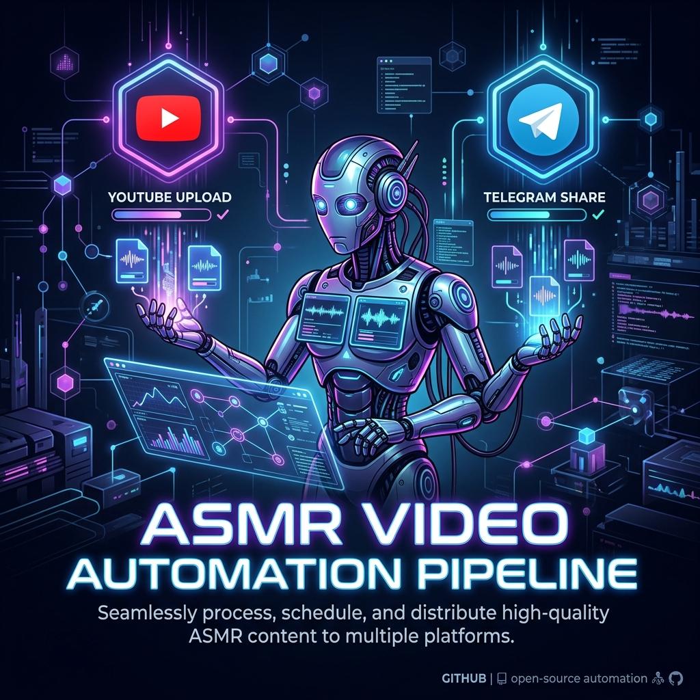

<div align="center">
  

  <h1>🎙️ ASMR Video Automation Pipeline</h1>
  
  <p><b>Generates short ASMR videos using Veo 3 (Google Gemini API), stitches them into platform-optimized cuts, and uploads to YouTube and Instagram Reels — fully automated from a single CLI command.</b></p>
</div>

<br>

```bash
python orchestrator.py \
  --prompt "ASMR wooden box tapping, soft candlelight" \
  --title "Relaxing ASMR 🪵" \
  --caption "Relaxing ASMR ✨ #asmr #sleep #relax" \
  --video-url "https://yourhost.com/ig_video.mp4"
```

---

## ⚠️ Critical Blockers — Read First

| Blocker | Platform | Wait Time | Workaround |
|---|---|---|---|
| **Veo 3 access** | Gemini API | Instant–days | Request at [ai.google.dev/gemini-api/docs/models](https://ai.google.dev/gemini-api/docs/models). API key alone is not enough. |
| **App Review** | Instagram | **2–4 weeks** | Use Dev Mode with your own test account while waiting |
| **OAuth2 verification** | YouTube | Days–weeks | Unverified apps can still upload as `private`; add test users in Cloud Console |

---

## Project Structure

```
.
├── config.py              # Loads all secrets from .env (never hardcoded)
├── generate_video.py      # Veo 3 clip generation + polling
├── stitch_video.py        # ffmpeg: concat + 16:9 YouTube + 9:16 Instagram cuts
├── upload_youtube.py      # YouTube Data API v3 resumable upload
├── upload_instagram.py    # Instagram Graph API Reels publish
├── orchestrator.py        # Full pipeline CLI entry point
├── requirements.txt       # Pinned Python dependencies
├── .env.example           # Template for environment variables
├── .gitignore             # Keeps secrets out of git
└── README.md              # This file
```

---

## Prerequisites

### 1. Python
- Python 3.11+ recommended
- Create and activate a virtual environment:
  ```bash
  python -m venv .venv
  # Windows:
  .venv\Scripts\activate
  # macOS/Linux:
  source .venv/bin/activate
  ```

### 2. Install dependencies
```bash
pip install -r requirements.txt
```

### 3. Install ffmpeg
ffmpeg must be on your `PATH`.

| Platform | Command |
|---|---|
| **Windows** | `winget install Gyan.FFmpeg` |
| **macOS** | `brew install ffmpeg` |
| **Linux** | `sudo apt install ffmpeg` |

Verify: `ffmpeg -version`

### 4. Create your `.env` file
```bash
cp .env.example .env
# Then edit .env with your actual values
```

---

## API Setup Guide

### A. Gemini API + Veo 3 Access

1. **Get an API key**
   - Go to [Google AI Studio](https://aistudio.google.com/app/apikey)
   - Click **Create API Key** → copy the key
   - Set it in `.env`: `GEMINI_API_KEY=your_key_here`

2. **Request Veo 3 access**
   - Veo 3 access is gated — your API key alone may not be enough.
   - Check your current model access at [ai.google.dev/gemini-api/docs/models](https://ai.google.dev/gemini-api/docs/models)
   - If `veo-3.0-generate-preview` is not available, join the waitlist via Google AI Studio or use the [Vertex AI path](https://cloud.google.com/vertex-ai/generative-ai/docs/video/generate-videos)
   - Confirm the exact model ID string in the docs — it changes between preview versions.

3. **Test**
   ```bash
   python generate_video.py --prompt "ASMR tapping on a wooden box" --count 1
   ```

---

### B. YouTube Data API v3 (OAuth2)

**Step-by-step Google Cloud Console setup:**

1. **Create a Google Cloud project** (if you don't have one)
   - [console.cloud.google.com](https://console.cloud.google.com/) → New Project

2. **Enable the YouTube Data API v3**
   - APIs & Services → Library → search "YouTube Data API v3" → Enable

3. **Create OAuth2 credentials**
   - APIs & Services → Credentials → Create Credentials → **OAuth client ID**
   - Application type: **Desktop app**
   - Name: `ASMR Pipeline` (or anything)
   - Click **Create** → Download the JSON file
   - Rename it `client_secret.json` and place it in the project root
   - Set in `.env`: `YOUTUBE_CLIENT_SECRET_PATH=client_secret.json`

4. **Configure OAuth consent screen**
   - APIs & Services → OAuth consent screen
   - User type: **External** (for personal accounts)
   - Fill in App name, support email
   - Add scope: `https://www.googleapis.com/auth/youtube.upload`
   - Add yourself as a **test user** (under "Test users")
   - Note: Unverified apps can still upload videos as `private`

5. **First run — browser auth**
   ```bash
   python upload_youtube.py --file output/youtube_horizontal.mp4 --title "Test"
   ```
   A browser window opens. Log in with your Google account and authorise.
   The token is saved to `youtube_token.json` for all future runs.

**Quota constraints:**
| Operation | Units |
|---|---|
| `videos.insert` (upload) | 1,600 |
| Daily default quota | 10,000 |
| **Max uploads/day** | **~6** |

Request a quota increase at [console.cloud.google.com/iam-admin/quotas](https://console.cloud.google.com/iam-admin/quotas) if needed.

---

### C. Instagram Graph API

> **⚠️ App Review — 2–4 week wait.** You cannot publish to arbitrary Instagram accounts until Meta approves your app. You CAN test on your own linked account in development mode immediately.

**Step-by-step Meta developer setup:**

1. **Create a Meta developer account**
   - [developers.facebook.com](https://developers.facebook.com/) → Get Started

2. **Create a new app**
   - My Apps → Create App
   - Use case: **Other** → Business
   - Fill in app name and contact email

3. **Add Instagram product**
   - Dashboard → Add Product → **Instagram** → Set up

4. **Link an Instagram Business Account**
   - Your Instagram account must be a **Business Account** (not Personal or Creator)
   - To convert: Instagram Settings → Account → Switch to Professional → Business
   - In the Meta app: Instagram → API setup → Connect your Instagram account

5. **Get your User ID**
   ```bash
   curl "https://graph.instagram.com/me?fields=id,username&access_token=YOUR_TOKEN"
   ```
   Set `IG_USER_ID=<the numeric id>` in `.env`

6. **Generate an access token**
   - Use [Graph API Explorer](https://developers.facebook.com/tools/explorer/)
   - Select your app → Generate User Token
   - Add permissions: `instagram_business_basic`, `instagram_business_content_publish`
   - Click **Generate Access Token**

7. **Exchange for a long-lived token (~60 day expiry)**
   ```bash
   curl "https://graph.instagram.com/access_token?grant_type=ig_exchange_token&client_id=APP_ID&client_secret=APP_SECRET&access_token=SHORT_TOKEN"
   ```
   Set the result as `IG_ACCESS_TOKEN` in `.env`

8. **Submit for App Review** (required to publish to any account)
   - App Dashboard → App Review → Permissions and Features
   - Request: `instagram_business_content_publish`
   - Provide a screencast demo of the publishing flow
   - Wait 2–4 weeks for approval

9. **While waiting for App Review — development mode test**
   - Add your own Instagram account as a tester: App Settings → Roles → Testers
   - You can publish Reels to your own test account immediately

**Token refresh (every ~60 days):**
```bash
curl "https://graph.instagram.com/refresh_access_token?grant_type=ig_refresh_token&access_token=CURRENT_TOKEN"
```
Update `IG_ACCESS_TOKEN` in `.env` with the refreshed token.
See: [Long-lived token refresh docs](https://developers.facebook.com/docs/instagram-basic-display-api/guides/long-lived-access-tokens)

---

## Usage

### Full pipeline
```bash
python orchestrator.py \
  --prompt "ASMR tapping on a wooden box, soft candlelight, 4K" \
  --title "Relaxing ASMR 🪵 | Wooden Box Tapping" \
  --caption "Relaxing ASMR ✨ Wooden box tapping #asmr #sleep #relaxing" \
  --clips 2 \
  --privacy private \
  --video-url "https://yourhost.com/instagram_vertical.mp4"
```

### YouTube only (skip Instagram)
```bash
python orchestrator.py \
  --prompt "ASMR rain on a wooden window" \
  --title "Rain ASMR 🌧️" \
  --caption "" \
  --skip-instagram
```

### Instagram only (skip generation + YouTube)
```bash
# Use existing stitched file and pre-hosted URL
python upload_instagram.py \
  --video-url "https://yourhost.com/video.mp4" \
  --caption "Relaxing ASMR ✨ #asmr"
```

### Run individual stages
```bash
# Generate clips only
python generate_video.py --prompt "ASMR sand texture" --count 3

# Stitch existing clips
python stitch_video.py output/clips/clip_001.mp4 output/clips/clip_002.mp4

# Upload to YouTube only
python upload_youtube.py \
  --file output/youtube_horizontal.mp4 \
  --title "ASMR Test" \
  --privacy private

# Upload to Instagram only (needs hosted URL)
python upload_instagram.py \
  --video-url "https://example.com/video.mp4" \
  --caption "#asmr"
```

### Verify config is loaded correctly
```bash
python config.py
```

---

## Known Constraints & Gotchas

| Constraint | Detail |
|---|---|
| **Veo clip length** | Each Veo 3 clip is short (varies by model tier, ~5–8s). Multiple clips are stitched together to reach a usable duration. |
| **Veo quota** | Billed per second of generated footage. See [Gemini API pricing](https://ai.google.dev/pricing). |
| **YouTube daily quota** | 10,000 units/day. One upload costs ~1,600 units = ~6 uploads/day max. |
| **Instagram max Reel duration** | 90 seconds via API. `stitch_video.py` auto-trims if combined clips exceed this. |
| **Instagram aspect ratio** | Must be **9:16** for Reels. `stitch_video.py` center-crops to this. |
| **Instagram video must be at a public URL** | Instagram fetches the video from a URL — no file upload. Use `--video-url` with a publicly hosted file. |
| **Instagram token expiry** | Long-lived tokens expire in ~60 days. Refresh manually (see above) or automate with a cron job. |
| **Instagram App Review** | `instagram_business_content_publish` requires Meta App Review (2–4 weeks). No workaround for third-party accounts. |
| **YouTube OAuth verification** | Unverified apps can upload to `private` with test users. Verification needed for public uploads to non-test-users. |
| **AI disclosure fields** | Both platforms add/rename AI disclosure API fields regularly. See TODO comments in `upload_youtube.py` and `upload_instagram.py` for links to current docs. |
| **ffmpeg on PATH** | ffmpeg must be installed and accessible. Set `FFMPEG_BIN` env var if it's in a non-standard location. |

---

## Environment Variables Reference

| Variable | Required | Default | Description |
|---|---|---|---|
| `GEMINI_API_KEY` | ✅ | — | Google Gemini API key |
| `VEO_MODEL` | — | `veo-3.0-generate-preview` | Veo model ID |
| `VEO_ASPECT_RATIO` | — | `16:9` | Raw clip aspect ratio |
| `YOUTUBE_CLIENT_SECRET_PATH` | For YT | `client_secret.json` | OAuth2 client secret path |
| `YOUTUBE_TOKEN_PATH` | For YT | `youtube_token.json` | OAuth2 token cache path |
| `YOUTUBE_CATEGORY_ID` | — | `22` | YouTube category ID |
| `YOUTUBE_PRIVACY_STATUS` | — | `private` | YouTube privacy default |
| `IG_USER_ID` | For IG | — | Instagram Business Account user ID |
| `IG_ACCESS_TOKEN` | For IG | — | Instagram long-lived access token |
| `IG_API_VERSION` | — | `v21.0` | Instagram Graph API version |
| `AI_CONTENT_DISCLOSURE` | — | `true` | Enable AI disclosure labels |
| `OUTPUT_DIR` | — | `output` | Root output directory |
| `CLIPS_DIR` | — | `output/clips` | Raw clip output directory |

---

## Troubleshooting

**`RuntimeError: Failed to start Veo generation`**
→ Your Gemini API key likely doesn't have Veo 3 access yet.
→ Check: [ai.google.dev/gemini-api/docs/models](https://ai.google.dev/gemini-api/docs/models)

**`FileNotFoundError: YouTube OAuth2 client secret not found`**
→ Download `client_secret.json` from [Google Cloud Console](https://console.cloud.google.com/apis/credentials)

**`EnvironmentError: Missing Instagram credentials`**
→ Set `IG_USER_ID` and `IG_ACCESS_TOKEN` in your `.env` file.

**`ValueError: video_url must be a public HTTPS URL`**
→ Instagram cannot access localhost. Host the `instagram_vertical.mp4` on a public server and pass the URL with `--video-url`.

**ffmpeg error: "No such file or directory"**
→ ffmpeg is not installed or not on PATH. Install it and try again (see Prerequisites).

**`HttpError 403: The caller does not have permission`** (YouTube)
→ Add your Google account as a test user in the OAuth consent screen settings.

**Instagram `status_code: ERROR` during polling**
→ Common causes: video not at a public URL, wrong aspect ratio (must be 9:16), unsupported codec, or duration > 90s.

---

## License

MIT — see LICENSE file.
